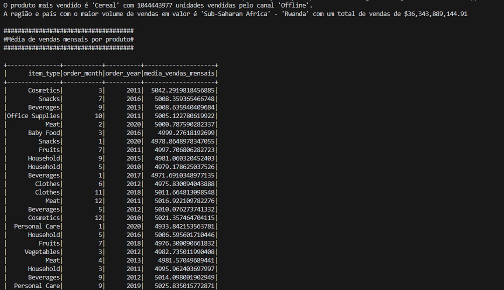

# teste_cogna
Print com o resultado obtido localmente
Código executado em uma máquina windows com 16GB de memória
Ao executar o código menos de 2GB foi utilizado segundo o gerenciador de tarefas

O código em PySpark implementa várias estratégias nativamente para otimizar o desempenho ao lidar com grandes volumes de dados. Uma das principais otimizações está na utilização de operações in-memory, onde dados são processados e mantidos na memória distribuída do cluster. Isso reduz significativamente a necessidade de leitura e escrita em disco, aproveitando ao máximo a velocidade de acesso à memória RAM.

Além disso, o código faz uso intensivo de execução paralela de tarefas. Por meio do Spark, todas as operações, desde a leitura do arquivo até as transformações complexas e cálculos agregados, são distribuídas em múltiplas partições de dados. Isso permite que diferentes nós do cluster executem tarefas simultaneamente, aproveitando os recursos disponíveis de forma eficiente e escalável.

Outra otimização crucial é o aproveitamento dos recursos do cluster. O Spark permite escalar horizontalmente, adicionando mais nós conforme necessário. Isso é essencial para lidar com picos de carga ou aumentos repentinos no volume de dados, garantindo que o processamento seja distribuído de maneira equitativa e sem sobrecarregar recursos individuais.

Além das estratégias de execução distribuída, o código utiliza transformações e ações específicas do Spark, como groupBy, agg, orderBy e format_number, escolhidas por sua eficiência no contexto distribuído. Essas operações são otimizadas para minimizar o movimento de dados entre nós e maximizar a paralelização das operações, garantindo que o processamento seja realizado de forma rápida e eficiente.

Portanto, as otimizações implementadas no código PySpark não apenas melhoram o desempenho geral, mas também garantem que ele seja escalável, robusto e capaz de lidar com grandes volumes de dados de maneira eficiente, fundamental para aplicações que exigem análises complexas e processamento de dados em larga escala.
